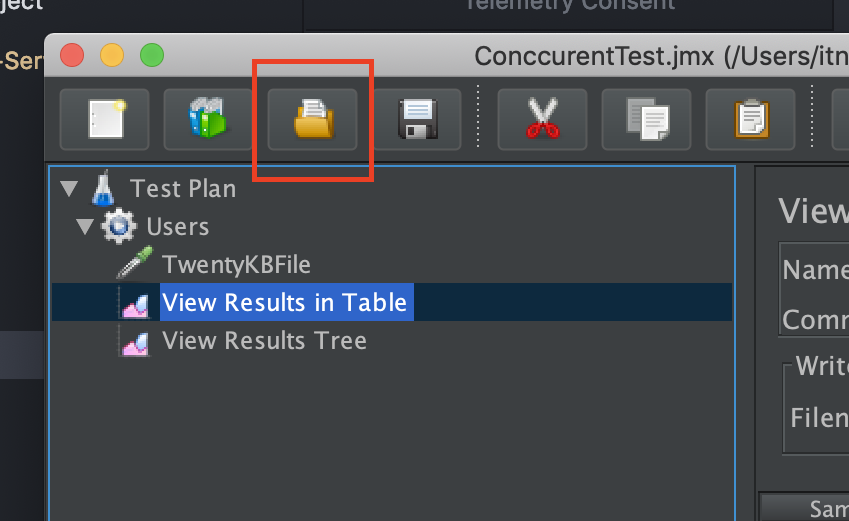
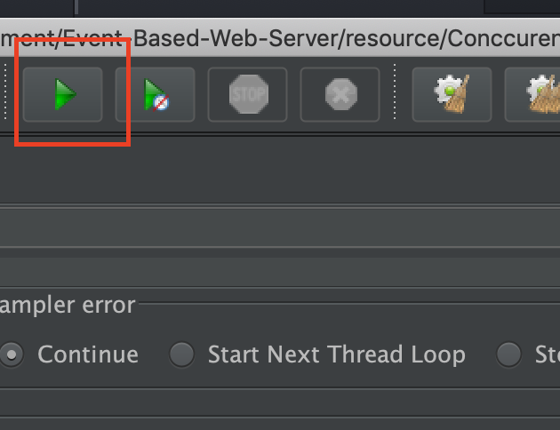

# Event-Based-Web-Server
Event based web server using low level library and high level library.

## Web-Server Benchmarking Tool
Tool used:
* [JMeter](https://jmeter.apache.org/)

### Requirement
* Java 8+

### Step
1. Download [JMeter](http://jmeter.apache.org/download_jmeter.cgi)
2. Extract downloaded file
3. open apache-jmeter-\<version\>/bin/jmeter.bat or
   ```
   sh apache-jmeter-<version>/bin/jmeter.sh
   ```
4. open test from resource folder (ConccurentTest.jmx)

5. run the test

6. JMeter will create file result.csv

### Test result
#### Nginx
* 500 Byte file
  * Average Latency: 2595.5 ms (3.174 Success Request/ 10.000 concurent request)
  * Memory Usage: 2.7 MB
* 20 KB file
  * Average Latency: 2447.5 ms (3.657 Success Request / 10.000 concurent request)
  * Memory Usage: 2.7 MB

#### Apache
* Average Latency:
* Memory Usage:
